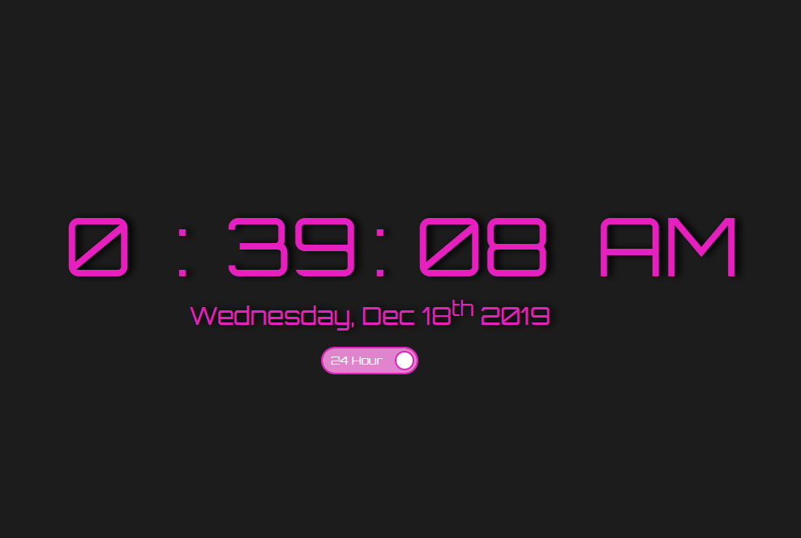

# Clock App

 

_A basic clock app with minor stylization using only Javascript, HTML and CSS_

 

View it in action [here](https://hahaketchup.github.io/Clock-App/)

 

## Summary

I had finally taken my first step to being a programmer early 2019 by buying class after class. It wasn't until later that year that I had actually put the effort in to begin putting into practice what I had learned and gotten serious about doing so.

This is my first major step to being the programmer that I want to be, and while it's simple, it's a major step for me. It's been a great learning experience.

## Author

* **Zimmer Matson** - *Programmer and Web Developer* - [LinkedIn](https://www.linkedin.com/in/zimmer-matson-2564b6142/)